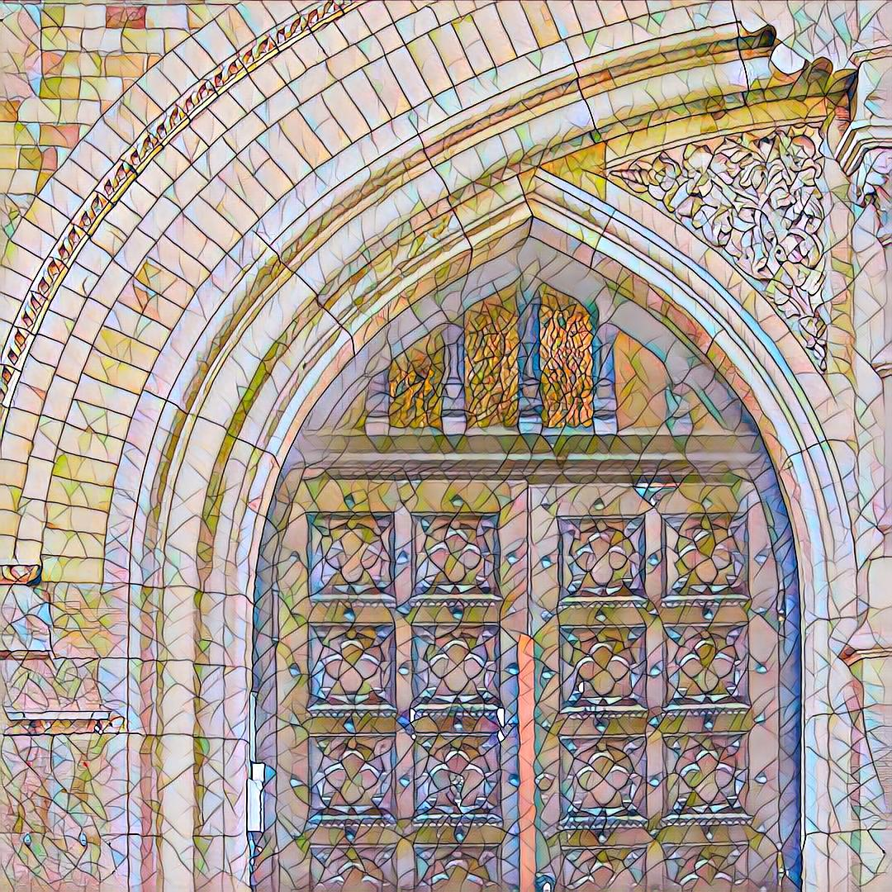
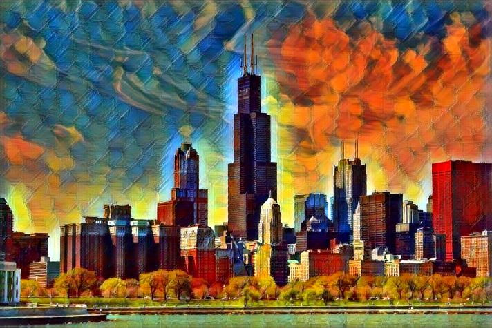
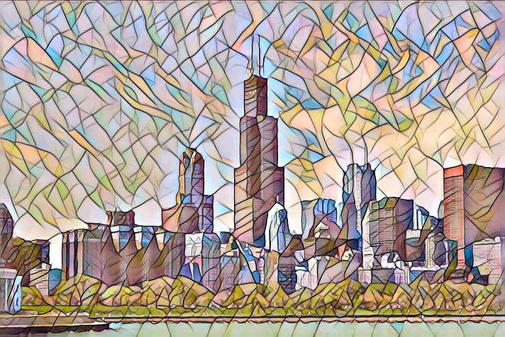

# Neural-Style-Transfer

# About :

This project contains a pytorch implementation of an algorithm for artistic style transfer. The algorithm can be used to mix the content of an image with the style of another image.

# Papers implemented :

Leon A. Gatys, Alexander S. Ecker, Matthias Bethge : A Neural Algorithm of Artistic Style ([Link](https://arxiv.org/abs/1508.06576))

Justin Johnson, Alexandre Alahi, Li Fei-Fei : Perceptual Losses for Real-Time Style Transfer and Super-Resolution ([Link](https://arxiv.org/abs/1603.08155))

Dmitry Ulyanov, Andrea Vedaldi, Victor Lempitsky : Instance Normalization: The Missing Ingredient for Fast Stylization ([Link](https://arxiv.org/abs/1607.08022))

# Result :

## (I) 
### Content Image :

### Style Image : 

### Output :

## (II)

### Content Image :

### Style Image : 

### Output :

## (III)

### Content Image :

### Style Image : 

### Output :

